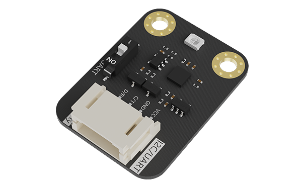

# Gravity: 240370 紫外线指数传感器 (UV Index Sensor)

[](https://opensource.org/licenses/MIT)
[](https://github.com/rockts/lekeopen-uvindex240370sensor)

<div align="center">
  
</div>

## 📋 项目简介

这是一款针对行空板优化的 DFRobot Gravity 系列 240370 紫外线指数传感器扩展，能检测 240-370nm 波长范围内的紫外线强度，涵盖 UVA、UVB、UVC 三种波长范围。通过底层处理，能直接输出 0-11 的 UV 指数等级和 1-5 的危害风险警告。本扩展包解决了行空板上的 I2C 通信问题，优化了设备识别和数据处理逻辑。

## ✨ 主要特点

- 🌈 波长范围 240-370nm，覆盖 UVA/UVB/UVC
- 🔢 直接输出紫外线指数与风险等级，无需转换
- 🛠️ 修复了行空板 PinPong 库 I2C 通信问题
- 📊 改进的 UV 指数计算和错误处理
- 🌐 支持 Arduino 和行空板双平台
- �� 提供 Mind+ 可视化编程支持

## 📥 下载与安装

在 [Releases](https://github.com/rockts/lekeopen-uvindex240370sensor/releases) 页面下载最新的扩展包。

- 当前版本：[lekeopen-uvindex240370sensor-V0.0.2.mpext](https://github.com/rockts/lekeopen-uvindex240370sensor/raw/main/lekeopen-uvindex240370sensor-V0.0.2.mpext)

## 🚀 使用方法

### Mind+ 中使用

1. 下载最新的 `.mpext` 扩展包文件
2. 打开 Mind+，点击"扩展"→"管理扩展"→"本地导入"
3. 选择下载的扩展包进行安装
4. 在积木区找到"Gravity: 240370 紫外线指数传感器"积木块
5. 使用积木块读取 UV 指数、原始数据或风险等级

### Python 代码中使用

```python
from unihiker_uv_patch_v3 import PatchUVSensor

# 创建传感器对象
sensor = PatchUVSensor()
sensor.begin()

# 读取数据
raw_value = sensor.read_UV_original_data()
uv_index = sensor.read_UV_index_data()
risk_level = sensor.read_risk_level_data()

print(f"原始值: {raw_value}")
print(f"UV指数: {uv_index}")
print(f"风险等级: {risk_level}")
```

### Arduino 中使用

```cpp
#include <DFRobot_UVIndex240370Sensor.h>

DFRobot_UVIndex240370Sensor UVSensor;

void setup() {
  Serial.begin(115200);

  // 初始化传感器
  UVSensor.begin();
}

void loop() {
  // 读取原始值
  uint16_t raw = UVSensor.getRaw();

  // 读取 UV 指数
  uint8_t index = UVSensor.getUvIndex();

  // 读取风险级别
  uint8_t riskLevel = UVSensor.getRiskLevel();

  Serial.print("原始值: ");
  Serial.println(raw);

  Serial.print("UV指数: ");
  Serial.println(index);

  Serial.print("风险等级: ");
  Serial.println(riskLevel);

  delay(1000);
}
```

## 🌡️ 紫外线风险等级指南

| 紫外线指数 | 风险等级 | 防护建议                                    |
| ---------- | -------- | ------------------------------------------- |
| 0-2        | 低风险   | 可以安全在户外活动，无需特殊防护            |
| 3-5        | 中等风险 | 在户外活动时建议使用防晒霜，佩戴太阳镜      |
| 6-7        | 高风险   | 避免在中午时分长时间暴露，使用 SPF15+防晒霜 |
| 8-10       | 很高风险 | 尽量减少户外活动，必要时采取全面防护措施    |
| 11+        | 极高风险 | 尽量避免在阳光下活动，必须采取全面防护      |

## 📁 仓库结构

```
lekeopen-uvindex240370sensor/
├── arduinoC/                  - Arduino 相关文件
│   ├── libraries/             - Arduino 库文件
│   │   ├── DFRobot_UVIndex240370Sensor/ - UV传感器库
│   │   └── libraries.zip      - 打包的库文件
│   ├── main.ts                - Mind+ Arduino积木定义
│   ├── _images/               - 扩展图片资源
│   └── _locales/              - 多语言翻译文件
│
├── python/                    - Python 相关文件
│   ├── libraries/             - Python 库文件
│   │   ├── unihiker_uv_patch_v3.py - 行空板 UV 传感器库
│   │   └── libraries.zip      - 打包的库文件
│   ├── main.ts                - Mind+ Python积木定义
│   ├── _images/               - 扩展图片资源
│   └── _locales/              - 多语言翻译文件
│
├── docs/                      - 项目文档
│   └── 各类指南与说明文档
│
├── examples/                  - 示例程序
│   ├── basic_uv_example.py    - 基础示例
│   └── gui_uv_monitor.py      - 图形界面示例
│
├── scripts/                   - 实用脚本
│   ├── build_extension.sh     - 扩展包构建脚本
│   └── manage_remote_mpext.sh - 远程仓库管理脚本
│
├── lekeopen-uvindex240370sensor-V0.0.2.mpext - 最新扩展包
├── config.json                - 扩展配置文件
├── LICENSE                    - MIT许可证
└── README.md                  - 项目说明文档
```

## 🔧 硬件连接

### Arduino 连接

| 传感器引脚 | Arduino 引脚         |
| ---------- | -------------------- |
| VCC        | 5V/3.3V              |
| GND        | GND                  |
| SDA        | A4 (UNO) / 20 (MEGA) |
| SCL        | A5 (UNO) / 21 (MEGA) |

### 行空板连接

| 传感器引脚 | 行空板引脚 |
| ---------- | ---------- |
| VCC        | 3.3V       |
| GND        | GND        |
| SDA        | SDA        |
| SCL        | SCL        |

## 📝 传感器规格

- **供电电压**: 3.3V - 5V
- **通信接口**: I2C
- **波长范围**: 240-370nm
- **测量范围**: 紫外线指数 0-11+
- **精度**: ±1 紫外线指数
- **响应时间**: <1s
- **工作温度**: -20℃ 至 85℃
- **尺寸**: 29.0 × 22.0 mm

## 🔄 版本历史

- **0.0.2** (2025.05.13)
  - 修复 Arduino Uno 兼容性问题
  - 添加扩展包管理功能
  - 优化库文件结构
- **0.0.1** (2025.05.12)
  - 首次发布
  - 支持行空板和 Arduino 平台
  - 基础 UV 指数测量功能

## 👨‍💻 贡献

欢迎提交问题和功能请求。如果您想贡献代码，请 fork 并提交 pull request。

## 📄 许可证

本项目采用 MIT 许可证，详情见 [LICENSE](./LICENSE) 文件。

## 📞 联系方式

- **作者**: rockts
- **邮箱**: gaopeng@lekee.cc
- **网站**: [乐可开源](https://www.lekee.cc)

---

<div align="center">
  <p>由乐可开源开发 &copy; 2025</p>
</div>
